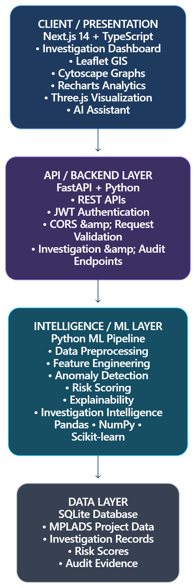

# 🛡️ SEVARTH
> **Explainable AI-Powered Investigation Intelligence for MPLADS (Member of Parliament Local Area Development Scheme)**

---

## 📌 Overview

**MPLAD-GUARD AI** is an advanced investigation and audit intelligence platform engineered to monitor, analyze, and detect anomalies in the execution of MPLAD scheme funds. By combining interactive geospatial visual analytics, machine learning anomaly detection, and a Google Gemini AI-driven RAG (Retrieval-Augmented Generation) knowledge engine, MPLAD-GUARD empowers auditors and policy investigators to ensure transparency, accountability, and compliance across constituencies in India.

---

## ✨ Key Features

- 🔍 **AI-Powered Anomaly & Audit Engine**: Automated detection of cost overruns, vendor concentration risks, timeline delays, and regulatory compliance flags.
- 🗺️ **Interactive 3D Geospatial Analytics**: Multi-layer maps and spatial intelligence across All-India constituencies with high-density focus on regions such as Bangalore.
- 📚 **AI RAG Knowledge Engine**: Context-aware Q&A trained on official MPLADS guidelines, circulars, and policy frameworks.
- 📋 **Automated Guidelines & Compliance Rules**: Real-time rule checker for scheme eligibility, fund allocation limits, and work authorization criteria.
- 📊 **Executive Dashboards & Case Management**: Deep-dive audit reports, golden case studies (e.g., Nalanda, Bihar investigation), and exportable compliance documentation.

---

# 🛡️ 

<div align="center">

[](LICENSE)
[](https://www.python.org/)
[](https://nodejs.org/)
[](https://fastapi.tiangolo.com/)
[](https://nextjs.org/)
[](https://github.com/CipherGhostBite/sevarth_mplad)
[](#testing--quality-control)
[](#testing--quality-control)
[](#code-quality-guidelines)

### AI-Powered Investigation & Audit Intelligence Platform for MPLADS

SEVARTH combines machine learning, forensic graph intelligence,
geospatial analytics, AI-assisted document analysis, and automated
report generation into a unified investigation workspace.

[Live Application](#deployment) •
[API Documentation](#api-documentation) •
[Architecture](#architecture--system-design) •
[Quick Start](#installation--configuration)

**Team: Coming4U**

</div>

---

# 1. Context & Overview

## 1.1 Elevator Pitch & Value Proposition

The **Member of Parliament Local Area Development Scheme (MPLADS)**
involves a large volume of developmental works, financial transactions,
contractors, project milestones, geographical information, and
administrative records.

Oversight becomes difficult when relevant information is distributed
across multiple datasets and when investigators need to identify
unusual expenditure patterns, suspicious entity relationships,
project delays, duplicate funding, and potential compliance issues.

**SEVARTH** is an explainable AI-powered investigation intelligence
platform designed to assist vigilance officers, auditors, investigation
teams, administrative officers, and policy researchers.

The platform combines:

1. **Unsupervised Machine Learning & Heuristic Risk Engine**
   - Isolation Forest
   - Statistical outlier analysis
   - Split-billing detection
   - Cost escalation analysis
   - Contractor-change analysis
   - Unspent-balance analysis

2. **Network Forensic Graph Intelligence**
   - Entity relationship analysis
   - Shared addresses
   - Shared directors
   - Vendor relationships
   - Graph traversal
   - Suspicious relationship clusters

3. **Interactive Geospatial Intelligence**
   - Parliamentary constituency mapping
   - GeoJSON overlays
   - Project locations
   - Risk heatmaps
   - Spatial clustering

4. **AI-Assisted Investigation Assistant**
   - Retrieval-Augmented Generation
   - Reference-document grounded analysis
   - Google integration
   - Investigation-oriented queries

5. **Cross-Government Coordination**
   - Cross-scheme comparison
   - Potential duplicate funding identification
   - Project attribute comparison
   - Geographic overlap analysis

6. **Automated Investigation Reporting**
   - Structured investigation dossiers
   - Risk breakdowns
   - Evidence-oriented reporting
   - PDF generation

---

## 1.2 Target Audience

SEVARTH is designed for:

| User Group | Primary Use |
|--------------------------|------------------------------------------|
| Vigilance Officers       | Investigation and anomaly identification |
| Audit Officers           | Financial and project-level analysis |
| Investigation Teams      | Entity and relationship investigation |
| Administrative Officers  | Project and constituency monitoring |
| Policy Researchers       | Guideline and compliance analysis |
| Enquiry Committees       | Structured investigation evidence |
| Nodal Authorities        | Cross-scheme coordination |

---

## 1.3 Core Features

| Module | Core Capability | Target Use |
|-------------------------------|---------------------------------------------------|--------------------|
| 🔍 Forensic Anomaly Engine    | Detects unusual expenditure and project patterns | Risk investigation |
| 🕸️ Syndicate Graph Explorer   | Traces relationships between entities            | Network investigation |
| 🗺️ Geospatial Intelligence    | Maps projects and risk indicators                | Spatial investigation |
| 🤖 AI Investigation Assistant | Context-aware AI analysis                        | Policy and investigation support |
| 📑 Dossier Generator          | Generates structured PDF reports                 | Investigation documentation |
| 🏛️ Cross-Scheme Auditor       | Identifies potentially overlapping funding       | Coordination |
| 📊 Risk Intelligence          | Produces explainable risk indicators             | Prioritization |
| 🔐 Evidence Management        | Organizes investigation evidence                 | Case management |
| 👮 Officer Log                | Records investigation activity                   | Audit trail |
| 🧠 AI Workstation             | Unified investigation workspace                  | Analyst workflow |

---

## 1.4 Explainability-First Design

SEVARTH is designed to provide **investigation intelligence rather than
black-box decisions**.

Risk indicators can be supported through:

- statistical anomalies
- rule-based conditions
- ML-based anomaly scores
- entity relationships
- geographic relationships
- project-level attributes
- reference-document context

The system is intended to assist investigators in prioritizing and
understanding records. Final administrative, audit, or legal
determinations remain with authorized human authorities.

---

## 1.5 Demo Screenshots & Media

Add high-resolution screenshots to:

text

docs/
└── screenshots/
    ├── dashboard.png
    ├── investigation.png
    ├── gis.png
    ├── graph-board.png
    ├── ai-workstation.png
    ├── evidence-locker.png
    └── reports.png


## 2. Architecture & System Design
<p align="center">
  
</p>
                         

#2.2 Service Boundaries
Frontend Layer

Responsible for:

dashboard rendering
user interaction
GIS visualization
graph visualization
AI assistant interface
risk visualization
report access
API Layer

Responsible for:

HTTP routing
authentication
request validation
service orchestration
frontend/backend communication
Intelligence Layer

Responsible for:

anomaly detection
risk scoring
graph analysis
GIS processing
AI/RAG operations
cross-government comparison
report generation
Data Layer

Responsible for:

project records
entity information
geographic datasets
reference documents
investigation state

#2.3 End-to-End Execution Flow

The following flow represents the intended investigation lifecycle:

                         ┌────────────────┐
                         │  INVESTIGATOR  │
                         └───────┬────────┘
                                 │
                                 │ Select constituency / project
                                 ▼
                     ┌───────────────────────┐
                     │   Next.js Frontend    │
                     └───────────┬───────────┘
                                 │
                                 │ Request investigation data
                                 ▼
                     ┌───────────────────────┐
                     │   FastAPI Backend     │
                     └───────────┬───────────┘
                                 │
                                 │ Retrieve projects & entities
                                 ▼
                     ┌───────────────────────┐
                     │       Database        │
                     └───────────┬───────────┘
                                 │
                                 │ Project records
                                 ▼
                     ┌───────────────────────┐
                     │    Risk Engine        │
                     └───────────┬───────────┘
                                 │
              ┌──────────────────┼──────────────────┐
              │                  │                  │
              ▼                  ▼                  ▼
       ┌──────────────┐   ┌──────────────┐   ┌──────────────┐
       │ Statistical  │   │ ML Anomaly   │   │ Rule-Based   │
       │ Analysis     │   │ Detection    │   │ Checks       │
       └──────┬───────┘   └──────┬───────┘   └──────┬───────┘
              │                  │                  │
              └──────────────────┼──────────────────┘
                                 │
                                 │ Analyse entity relationships
                                 ▼
                     ┌───────────────────────┐
                     │ NetworkX Graph Engine │
                     └───────────┬───────────┘
                                 │
                                 │ Relationship information
                                 ▼
                     ┌───────────────────────┐
                     │ Risk Indicators +     │
                     │ Explanations          │
                     └───────────┬───────────┘
                                 │
                                 │ Investigation results
                                 ▼
                     ┌───────────────────────┐
                     │   Next.js Frontend    │
                     └───────────┬───────────┘
                                 │
                                 ▼
                ┌────────────────────────────────┐
                │ Dashboard + GIS + Graph View   │
                └────────────────┬───────────────┘
                                 │
                                 │ Investigator asks question
                                 ▼
                     ┌───────────────────────┐
                     │   AI Query            │
                     └───────────┬───────────┘
                                 │
                                 ▼
                     ┌───────────────────────┐
                     │   FastAPI Backend     │
                     └───────────┬───────────┘
                                 │
                                 │ Query + available context
                                 ▼
                     ┌───────────────────────┐
                     │    Gemini RAG         │
                     └───────────┬───────────┘
                                 │
                                 │ Retrieve relevant reference material
                                 ▼
                     ┌───────────────────────┐
                     │ Reference Guidelines  │
                     │ / Documents           │
                     └───────────┬───────────┘
                                 │
                                 ▼
                     ┌───────────────────────┐
                     │ Context-Grounded      │
                     │ Gemini Request         │
                     └───────────┬───────────┘
                                 │
                                 │ Generated response
                                 ▼
                     ┌───────────────────────┐
                     │ Explainable AI        │
                     │ Analysis              │
                     └───────────┬───────────┘
                                 │
                                 ▼
                     ┌───────────────────────┐
                     │ Investigator receives │
                     │ AI-assisted response  │
                     └───────────────────────┘


                         REPORT GENERATION FLOW
                         =====================

                     Investigator
                          │
                          │ Generate Report
                          ▼
                   ┌───────────────┐
                   │ Next.js       │
                   │ Frontend      │
                   └───────┬───────┘
                           │
                           │ Report Request
                           ▼
                   ┌───────────────┐
                   │ FastAPI       │
                   │ Backend       │
                   └───────┬───────┘
                           │
                           │ Generate Dossier
                           ▼
                   ┌───────────────┐
                   │ PDF Report    │
                   │ Generator     │
                   └───────┬───────┘
                           │
                           │ Retrieve investigation information
                           ▼
                   ┌───────────────┐
                   │ Database      │
                   └───────┬───────┘
                           │
                           │ Investigation data
                           ▼
                   ┌───────────────┐
                   │ PDF Report    │
                   └───────┬───────┘
                           │
                           │ Generated report
                           ▼
                   ┌───────────────┐
                   │ Next.js       │
                   │ Frontend      │
                   └───────────────┘

#2.4 Investigation Data Flow
Raw Project / Financial Data
            │
            ▼
     Data Validation
            │
            ▼
    Feature Extraction
            │
            ├───────────────┐
            ▼               ▼
 Statistical Analysis    ML Analysis
            │               │
            └───────┬───────┘
                    ▼
             Risk Indicators
                    │
                    ▼
          Entity Relationship
                Analysis
                    │
                    ▼
             Graph Intelligence
                    │
                    ▼
           Investigation Context
                    │
             ┌──────┴──────┐
             ▼             ▼
          Dashboard       AI/RAG
             │             │
             └──────┬──────┘
                    ▼
          Explainable Findings
                    │
                    ▼
             PDF Investigation
                 Dossier
## 2.5 Documentation Links
Production API

Swagger UI

https://sevarth-mplad.onrender.com/docs

OpenAPI JSON

https://sevarth-mplad.onrender.com/openapi.json
Local API
http://127.0.0.1:8000/docs
http://127.0.0.1:8000/openapi.json
Technical Documentation

Recommended documentation structure:

docs/
├── architecture.md
├── api.md
├── deployment.md
├── ml-methodology.md
├── security.md
├── screenshots/
└── demo/
## 3. Installation & Configuration
# 3.1 Prerequisites & Tech Stack
Component	Requirement	Tested / Recommended
Python	>= 3.11	3.11 / 3.12 / 3.13
Node.js	>= 20.x	Node 20 LTS+
npm	>= 10.x	npm 10+
RAM	Minimum 4 GB	8 GB recommended
CPU	Minimum 2 cores	4 cores recommended
Storage	Minimum 2 GB free	5 GB+ recommended
GPU	Not required	CPU runtime supported
OS	Linux / macOS / Windows	Cross-platform

# 3.2 Technology Stack
Frontend
Next.js 14
React
TypeScript
Tailwind CSS
Recharts
Cytoscape.js
Leaflet
Three.js
Backend
Python
FastAPI
Uvicorn
SQLAlchemy
Pydantic
Machine Learning
Scikit-learn
Isolation Forest
Pandas
NumPy
Statistical analysis
Rule-based anomaly detection
Graph Intelligence
NetworkX
Entity relationship analysis
Graph traversal
Cluster analysis
Relationship analysis
AI
Retrieval-Augmented Generation
Google Gemini
Reference-document grounded analysis
Reporting
ReportLab
Deployment
Vercel
Render

# 3.3 Step-by-Step Installation
Step 1 — Clone Repository
git clone https://github.com/CipherGhostBite/sevarth_mplad.git

cd sevarth_mplad
Step 2 — Create Python Virtual Environment

macOS / Linux:

python3 -m venv .venv

source .venv/bin/activate

Windows:

python -m venv .venv

.venv\Scripts\activate
Step 3 — Upgrade pip
python -m pip install --upgrade pip
Step 4 — Install Backend Dependencies
pip install -r backend/requirements.txt
Step 5 — Install Frontend Dependencies
cd frontend

npm install

cd ..
Step 6 — Configure Environment Variables

Create the required environment file(s).

Backend example:

GEMINI_API_KEY=your_gemini_api_key
JWT_SECRET=your_secure_jwt_secret

Frontend example:

NEXT_PUBLIC_API_URL=http://127.0.0.1:8000
Step 7 — Start Backend

From the repository root:

uvicorn backend.app.main:app --reload --port 8000

Backend:

http://127.0.0.1:8000

Swagger:

http://127.0.0.1:8000/docs
Step 8 — Start Frontend

Open another terminal:

cd frontend

npm run dev

Frontend:

http://localhost:3000

# 3.4 Production Deployment
Frontend
Platform: Vercel
Framework: Next.js
Backend
Platform: Render
Framework: FastAPI + Uvicorn

Production backend:

https://sevarth-mplad.onrender.com

Production API documentation:

https://sevarth-mplad.onrender.com/docs

# 3.5 Environment Variables Matrix
Variable	Description	Type	Default	Required
JWT_SECRET	Secret used for JWT signing/verification	String	None	Yes
GEMINI_API_KEY	Google Gemini API authentication key	String	None	Optional
NEXT_PUBLIC_API_URL	Backend API URL consumed by frontend	String / URL	http://127.0.0.1:8000	Yes
PORT	Application/server port	Integer	Platform-defined / 8000 local	No
DATABASE_URL	Database connection string	String	Project default	No
Local Frontend
NEXT_PUBLIC_API_URL=http://127.0.0.1:8000
Production Frontend
NEXT_PUBLIC_API_URL=https://sevarth-mplad.onrender.com
Example Backend Configuration
JWT_SECRET=replace_with_secure_secret

GEMINI_API_KEY=replace_with_real_api_key

DATABASE_URL=your_database_connection_string

Never commit .env, .env.local, API keys, passwords, JWT secrets,
or access tokens to the repository.


## 4. Developer Experience & Quality Control
# 4.1 Usage Snippets
A. Authentication
curl -X POST "http://127.0.0.1:8000/api/auth/login" \
     -H "Content-Type: application/json" \
     -d '{
       "email": "investigator@example.com",
       "password": "YOUR_PASSWORD"
     }'

The response can be used to obtain an authentication token.

# 4.2 Authenticated API Request
curl -X GET "http://127.0.0.1:8000/api/projects/" \
     -H "Authorization: Bearer YOUR_JWT_TOKEN"
# 4.3 Project Risk Query
import requests

BASE_URL = "http://127.0.0.1:8000/api"

headers = {
    "Authorization": "Bearer YOUR_JWT_TOKEN"
}

response = requests.get(
    f"{BASE_URL}/projects/",
    headers=headers
)

response.raise_for_status()

data = response.json()

print(data)
# 4.4 AI Investigation Query
curl -X POST "http://127.0.0.1:8000/api/assistant/chat" \
     -H "Authorization: Bearer YOUR_JWT_TOKEN" \
     -H "Content-Type: application/json" \
     -d '{
       "query": "Analyse the available project records for unusual expenditure patterns.",
       "constituency": "Nalanda"
     }'
# 4.5 Testing & QA Commands
Backend Unit Tests
pytest backend/tests/test_api.py -v
Full Backend Test Suite
pytest backend/tests/ -v
Coverage
pytest --cov=backend/app backend/tests/
# 4.6 Frontend Type Checking
cd frontend

npx tsc --noEmit
# 4.7 Frontend Linting
cd frontend

npm run lint
# 4.8 Production Build Verification
cd frontend

npm run build
# 4.9 PDF Report Verification
python generate_pdf_report.py
# 4.10 Recommended Pre-Commit Verification

Before pushing a feature:

 Backend tests
pytest backend/tests/ -v

 Backend coverage
pytest --cov=backend/app backend/tests/

 Frontend type checking
cd frontend
npx tsc --noEmit

 Frontend lint
npm run lint

 Production build
npm run build
# 4.11 Git Development Workflow
Create Branch
      │
      ▼
Implement Feature
      │
      ▼
Run Tests
      │
      ▼
Run Static Checks
      │
      ▼
Run Production Build
      │
      ▼
Commit
      │
      ▼
Push
      │
      ▼
Pull Request
      │
      ▼
Review
      │
      ▼
Merge

Create a feature branch:

git checkout -b feature/your-feature-name

Stage changes:

git add .

Commit:

git commit -m "feat: describe your change"

Push:

git push origin feature/your-feature-name
## 5. Reliability, Performance & Security
# 5.1 Benchmarks & Maturity Status
Current Readiness
Beta / Competition-Ready

The benchmark figures below represent the project reference
measurements documented for the evaluation build. Actual performance
depends on hardware, deployment environment, dataset size, caching,
network latency, and external AI provider response time.

Operation	Reference Performance
API Health Check & Metadata	< 8 ms
543 Constituency GeoJSON Loading	< 85 ms
Anomaly Scoring & Heuristic Pipeline	< 120 ms for 1,000 projects
Syndicate Graph Cycle Detection	< 45 ms on 250 nodes
Gemini RAG Retrieval + Generation	~1.2 s average

The original project specification documents these values as the
evaluation benchmark profile.

Performance Factors

Actual production latency depends on:

CPU resources
memory availability
database performance
dataset size
graph complexity
geographic dataset size
network latency
Gemini API latency
cache state
deployment infrastructure

Therefore these measurements should be treated as reference
benchmarks rather than production SLAs.

# 5.2 Reliability Strategy

SEVARTH separates the application into:

Frontend
   ↓
API Layer
   ↓
Service Layer
   ↓
Intelligence Engines
   ↓
Data / External Services

This separation helps isolate:

UI failures
API failures
data processing failures
AI provider failures
database failures

AI-assisted functionality can use deterministic analytical logic
where applicable so that investigation workflows are not completely
dependent on generative AI availability.

# 5.3 Troubleshooting & Known Limitations
Issue / Error	Root Cause	Resolution / Workaround
ModuleNotFoundError: No module named 'backend'	Command executed outside project root or Python path issue	Run commands from repository root and activate the virtual environment
GeoJSON fails to render	Required constituency GeoJSON unavailable	Verify .india_ls_seats_543.geojson is present
Map returns 404	Incorrect GeoJSON/API path	Verify frontend API configuration and dataset path
Gemini API 403	Invalid/missing API key or quota issue	Configure a valid GEMINI_API_KEY and check provider quota
Gemini API unavailable	External provider failure	Use available deterministic/rule-based analytical functionality
Port 3000 already in use	Existing frontend process	Stop the process using port 3000
Port 8000 already in use	Existing backend process	Stop the process using port 8000
Frontend API 404	Incorrect backend URL	Verify NEXT_PUBLIC_API_URL
CORS error	Backend origin configuration	Verify allowed frontend origins
Python dependency failure	Runtime/package incompatibility	Use supported Python runtime and reinstall dependencies
npm build failure	Dependency or lockfile issue	Remove/reinstall dependencies and run build again
macOS / Linux Port Cleanup
lsof -ti:8000 | xargs kill -9
lsof -ti:3000 | xargs kill -9
5.4 Known Technical Limitations
AI Dependence

AI-generated responses depend on:

available reference documents
prompt/context quality
Gemini availability
API quota
retrieval quality

AI output should therefore be treated as investigation assistance
rather than an autonomous final determination.

Dataset Dependence

Risk detection quality depends on:

completeness of project data
accuracy of financial records
entity information
geographic data
reference documents
Large-Scale Processing

Very large datasets may require:

database indexing
caching
asynchronous processing
additional compute resources
graph optimization
Geographic Data

The GIS experience depends on the availability and correctness of the
underlying GeoJSON constituency dataset.

# 5.5 Security Architecture

SEVARTH uses application-level security mechanisms including:

Authentication

Stateless JWT authentication using HMAC-SHA256 signature verification.

Input Validation

Pydantic-based request and response validation.

Database Protection

Parameterized ORM/database operations to reduce SQL injection risks.

Secret Management

Secrets are supplied through environment variables instead of source
code.

API Protection

Protected endpoints require appropriate authentication credentials.

# 5.6 Security Checklist

Before deployment:

[ ] JWT secret configured securely
[ ] Gemini API key stored in environment
[ ] Database credentials not committed
[ ] .env files excluded from Git
[ ] Production CORS configured
[ ] Debug mode disabled in production
[ ] Dependencies updated
[ ] API authentication verified
[ ] Sensitive logs removed
[ ] Access tokens not exposed to frontend logs
## 5.7 Responsible Vulnerability Disclosure

Security vulnerabilities should be reported privately rather than
being immediately disclosed through public issues.

Please include:

vulnerability description
affected component
reproduction steps
expected behaviour
actual behaviour
potential impact
suggested mitigation, if available
Security Contact
shivam.choudhary.dev@gmail.com

You may also use the repository's GitHub Security reporting mechanism
for private vulnerability disclosure.

Please do not publish credentials, access tokens, private data, or
complete exploit details in public issues.

## 6. Governance & License
# 6.1 Open Source License

SEVARTH is distributed under the:

MIT License

See:

LICENSE

for the complete license text.

# 6.2 Contribution Guidelines

Contributors should follow the development workflow:

Issue / Requirement
        ↓
Feature Branch
        ↓
Implementation
        ↓
Testing
        ↓
Static Analysis
        ↓
Build Verification
        ↓
Pull Request
        ↓
Code Review
        ↓
Merge
# 6.3 Code Style Rules
Python

Follow:

PEP 8-compatible formatting
meaningful names
type hints where appropriate
focused functions
modular service design
explicit error handling
no hard-coded secrets

Recommended tooling:

ruff check .
TypeScript / React

Follow:

TypeScript type safety
component-based architecture
meaningful component names
reusable UI components
avoid unnecessary state
avoid hard-coded API URLs
environment-based configuration

Run:

cd frontend

npx tsc --noEmit

npm run lint
# 6.4 Commit Message Convention

Use descriptive commits.

Examples:

feat: add constituency risk dashboard

fix: resolve GIS GeoJSON loading issue

docs: update installation instructions

refactor: improve anomaly scoring service

test: add project risk API tests

chore: update dependencies
# 6.5 Pull Request Guidelines

Every pull request should ideally include:

clear title
problem description
implementation summary
screenshots for UI changes
testing performed
known limitations
deployment considerations

Example:

## What changed?

Added constituency-level risk visualization.

## Why?

Allows investigators to inspect project risk geographically.

## Testing

- pytest backend/tests/
- npm run lint
- npx tsc --noEmit
- npm run build

## Screenshots

Attach relevant UI screenshots.
# 6.6 Project Structure
sevarth_mplad/
│
├── backend/
│   ├── app/
│   │   ├── routes/
│   │   ├── services/
│   │   └── main.py
│   │
│   ├── pipeline/
│   ├── tests/
│   └── requirements.txt
│
├── frontend/
│   ├── src/
│   ├── public/
│   ├── package.json
│   └── ...
│
├── docs/
│   ├── screenshots/
│   ├── diagrams/
│   └── demo/
│
├── run_app.py
├── generate_pdf_report.py
├── README.md
└── LICENSE
## 7. Deployment
Frontend
Platform: Vercel
Framework: Next.js
Backend
Platform: Render
Framework: FastAPI + Uvicorn
Production Backend
https://sevarth-mplad.onrender.com
Production API Documentation
https://sevarth-mplad.onrender.com/docs

## 8. Project Status
Component	Status
Next.js Frontend	✅ Implemented
FastAPI Backend	✅ Implemented
Investigation Dashboard	✅ Implemented
ML Risk Engine	✅ Implemented
Graph Intelligence	✅ Implemented
GIS Intelligence	✅ Implemented
AI / RAG Assistant	✅ Implemented
Cross-Government Coordination	✅ Implemented
Evidence Management	✅ Implemented
PDF Reporting	✅ Implemented
Constituency Dataset	✅ Implemented
Frontend Deployment	✅ Deployed
Render Backend	✅ Deployed
Expanded CI/CD Automation	🔄 In Progress
Expanded Benchmark Suite	🔄 In Progress
Coverage Reporting	🔄 In Progress

## 9. Demo & Documentation Checklist

For technical evaluation, the repository should contain:

[ ] README.md
[ ] LICENSE
[ ] Source Code
[ ] Backend Requirements
[ ] Frontend package.json
[ ] Architecture Diagram
[ ] Execution Flow Diagram
[ ] API Documentation
[ ] Screenshots
[ ] Demo Video
[ ] Environment Variable Documentation
[ ] Testing Instructions
[ ] Security Reporting Instructions
[ ] Contribution Guidelines

## 10. Repository

GitHub:

https://github.com/CipherGhostBite/sevarth_mplad

Live Backend:

https://sevarth-mplad.onrender.com

API Documentation:

https://sevarth-mplad.onrender.com/docs

## 11. Team
Coming4U
SEVARTH

Explainable AI-Powered Investigation Intelligence for MPLADS

## 12. Final Statement

SEVARTH is designed to transform fragmented governance and project
information into structured, explainable investigation intelligence.

The platform brings together:

Governance Data
      +
Machine Learning
      +
Rule-Based Analysis
      +
Graph Intelligence
      +
Geospatial Intelligence
      +
AI-Assisted Investigation
      +
Automated Reporting
      ↓
Explainable Investigation Intelligence

SEVARTH is intended to assist investigators and auditors, helping
them identify patterns, prioritize records, explore relationships,
inspect geographic context, and generate structured evidence-oriented
reports.

Final decisions remain with authorized human investigators and
administrative authorities.


## 🛠️ Technology Stack

### **Frontend**
- **Framework**: Next.js 14 (TypeScript)
- **Styling**: Tailwind CSS, CSS Modules
- **UI & Animations**: Lucide Icons, Recharts, Framer Motion
- **State & Router**: Next.js App Router

### **Backend**
- **API Framework**: FastAPI (Python 3.10+)
- **Database**: SQLite / SQLModel
- **AI & RAG**: Google Gemini API, LangChain / RAG service
- **Server**: Uvicorn ASGI

---

## 🚀 Getting Started

### **Prerequisites**
- Python 3.10+
- Node.js 18+ & npm

### **Quick Run (Frontend + Backend)**

Run the single orchestration script to start both services simultaneously:

```bash
python run_app.py
```

- 🌐 **Frontend App**: [http://localhost:3000](http://localhost:3000)
- ⚙️ **Backend API Docs**: [http://127.0.0.1:8000/api/docs](http://127.0.0.1:8000/api/docs)
- 🔑 **Demo Credentials**: `investigator@mpladguard.gov.in` / `admin123`

---

## 👤 Author & Maintainer

- **Shivam Kumar Choudhary**
- 🔗 **LinkedIn**: [https://www.linkedin.com/in/shivam-kumar-choudhary-560486332/](https://www.linkedin.com/in/shivam-kumar-choudhary-560486332/)

---

## 📜 License

This project is open-source under the MIT License.
